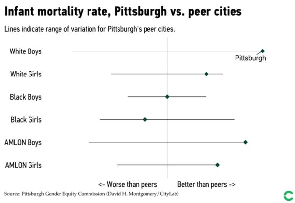

## Step 1: Find A Visualization + Its Associated Data

### Overview 
I was inspired to recreate data on the livability index in Pittsburgh because it was something that I was taken aback by when I first moved to the city. Pittsburgh's outcomes for Black and White residents is drastically different, leading  Mayor Bill Peduto to acknowledge in his 2020 Mayoral 
bid video that many residents in the city feel as though there is a "white Pittsburgh" and a "black Pittsburgh" [^1]. Pittsburgh is a city of stark constrasts -- the city has repeatedly been listed on "Most Livable Cities" lists while there have also been articles noted that the life characteristics of **black women** would change drastically by *just* picking up and leaving Pittsburgh for greener pastures [^2]. The City of Pittsburgh's Gender Equity Commitee Released a report in September of 2019 highlighting this "livability" divide further across dimensions such as health outcomes, educational outomces, and career outcomes. [^3]

For the purposes of this recretation, I focused on the health outcome disparties for black women in Pittsburgh, because this data all came from the same dataset, the National Vital Statistics System. The Bloomberg CityLab article that the following visualizations came from is this one: https://www.bloomberg.com/news/articles/2019-09-20/how-pittsburgh-fails-black-women-in-6-charts. 

### Original Visualizations
Here is the original infant mortality rate visualization from the Bloomberg CityLab article. The title of the visualization is "Infant mortality rate, Pittsburgh vs peer cities". 

### Data Source Description

National Vital Statistics System.

~~From the equity report that was released, fetal mortality is defined as: "Fetal death includes any spontaneous intrauterine death of a fetus at any time during pregnancy. In Pennsylvania, all pregnancies at least 16 weeks past gestation that end in a fetal death are recorded. This includes "stillbirths" or fetuses born 20 weeks after gestation who demonstrate no signs of life at birth. We calculated fetal mortality as the number of fetal deaths divided by the number of pregnancies within the year. We calculated pregnancies within the year as the total number of babies born plus the number
of fetal deaths. In other words, pregnancies that end before 16 weeks after gestation are not included."~~

The equity report defines infant mortality in the following way:
**infant mortality**: We define the infant mortality rate as the number of babies under the age of one that pass away in a
given year divided by the number of live births in that year.

## Step 2: Critique the Visualization

This visualization seems to suffer from the paradox of being so simple that it becomes unclear, similar to the "simple, unclear bar chart" from the Crafting for Clarity chapter of "Good Charts".

[insert the scaffolding of the critique from the google form here]

My initial reaction to the above visualization was that I was pleased by how the overall simplicity and minimalism of the deisgn. The use of the faint gray line also indicated immediately to be that there was some baseline or average from which a deviation in the data was being measured. Additionally, the visualization uses a simple diamond to point out Pittsburgh's position along the line, where it is compares to other similar sized cities.

The general approach that I'm taking in this critique is to find a different way of representing the above data. While I think the simplicity of the data visualization is effective, I think it also masks important information about the degree to which the infant mortality rate for black girls in Pittsburgh is lower than their non-black peers. There is no imformation provided on the x-axis of about what the middle gray line that denotes the cutoff between "worse than peers" and "better than peers" is actually in reference to. For instance, the mean infant mortality rate could be 2%, with each of the increments away from that line being 0.1 of a percentage point, which could indicate a far smaller different in infant mortality rates than what the visualizing is actually showing. 

Also, the data masks information about what other cities Pittsburgh is being compared against. It would be useful from the readers perspective to know if the comparisons that are being made and the cities that are considered to be "peers" are actually comparable.
Furthermore, the overall comparison in the data is actually about how specifically black women fare in pittsburgh along different livability axes vs their non-black female pairs. It seems like an effective use of color/shape, would be use to the diamond shape to represent pittsburgh and them some red or other distinct color to call out how black women/girls are falling short on that particular metric in the city.

Another thing I notice, because the x-axis dimensions/scale is unclear, is that the subtitle of the graph has to do the job of explaining what the lines actually mean because this is not readly apparent in the visualization. Specifcally, the subtitle 

Overall, the visualization achieves it's goal of highlighting racial and gender disparties in infant mortality rates but this could be done more effectively and efficiently.  

**Usefulness** -- this infor

In both of the above visualizations, I think their strength strength

The double-edged sword of this simplicity is that it is a bit unclear on what scale the data is measured in as well as what exactly is being considered a "similar" city.

## Step 3: Wireframe a Solution

## Step 4: Test the Solution

## Step 5: Build Your Solution (Voila!)

### References

[^1]: https://www.politicspa.com/peduto-addresses-racial-equity-criticism-in-first-ad/97795
[^2]: https://www.bloomberg.com/news/articles/2020-01-09/the-best-and-worst-cities-for-black-women)
[^3]: https://apps.pittsburghpa.gov/redtail/images/10645__Pittsburgh's_Inequality_Across_Gender_and_Race_JULY_2020.pdf
