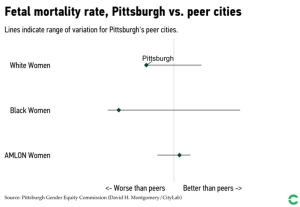

## Step 1: Find A Visualization + Its Associated Data

### Overview 
I was inspired to recreate data on the livability index in Pittsburgh because it was something that I was taken aback by when I first moved to the city. Pittsburgh's outcomes for Black and White residents is drastically different, leading  Mayor Bill Peduto to acknowledge in his 2020 Mayoral 
bid video that many residents in the city feel as though there is a "white Pittsburgh" and a "black Pittsburgh" [^1]. Pittsburgh is a city of stark constrasts -- the city has repeatedly been listed on "Most Livable Cities" lists while there have also been articles noted that the life characteristics of **black women** would change drastically by *just* picking up and leaving Pittsburgh for greener pastures [^2]. The City of Pittsburgh's Gender Equity Commitee Released a report in September of 2019 highlighting this "livability" divide further across dimensions such as health outcomes, educational outomces, and career outcomes. [^3]

For the purposes of this recretation, I focused on the health outcome disparties for black women in Pittsburgh, because this data all came from the same dataset, the National Vital Statistics System. The Bloomberg CityLab article that the following visualizations came from is this one: https://www.bloomberg.com/news/articles/2019-09-20/how-pittsburgh-fails-black-women-in-6-charts. 

### Original Visualizations
Here's are the health/maternal health outcomes visualizations provided in the original report.

### Data Source Description

National Vital Statistics System.

From the equity report that was released, fetal mortality is defined as: "Fetal death includes any spontaneous intrauterine death of a fetus at any time during pregnancy. In Pennsylvania, all pregnancies at least 16 weeks past gestation that end in a fetal death are recorded. This
includes "stillbirths" or fetuses born 20 weeks after gestation who demonstrate no signs of life at birth.
We calculated fetal mortality as the number of fetal deaths divided by the number of pregnancies within
the year. We calculated pregnancies within the year as the total number of babies born plus the number
of fetal deaths. In other words, pregnancies that end before 16 weeks after gestation are not included."

**infant mortality**: We define the infant mortality rate as the number of babies under the age of one that pass away in a
given year divided by the number of live births in that year.

## Step 2: Critique the Visualization

[insert the scaffolding of the critique from the google form here]

In both of the above visualizations, I think their strength

The double-edged sword of this simplicity is that it is a bit unclear on what scale the data is measured in as well as what exactly is being considered a "similar" city.

## Step 3: Wireframe a Solution

## Step 4: Test the Solution

## Step 5: Build Your Solution (Voila!)

### References

[^1]: https://www.politicspa.com/peduto-addresses-racial-equity-criticism-in-first-ad/97795
[^2]: https://www.bloomberg.com/news/articles/2020-01-09/the-best-and-worst-cities-for-black-women)
[^3]: https://apps.pittsburghpa.gov/redtail/images/10645__Pittsburgh's_Inequality_Across_Gender_and_Race_JULY_2020.pdf
