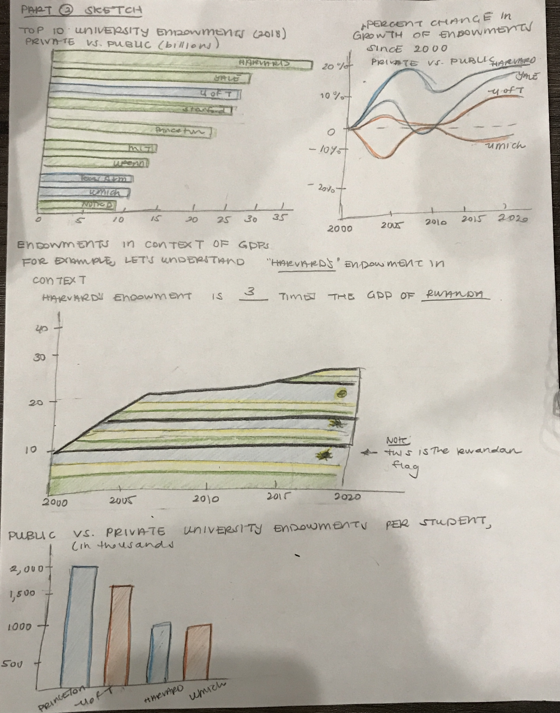
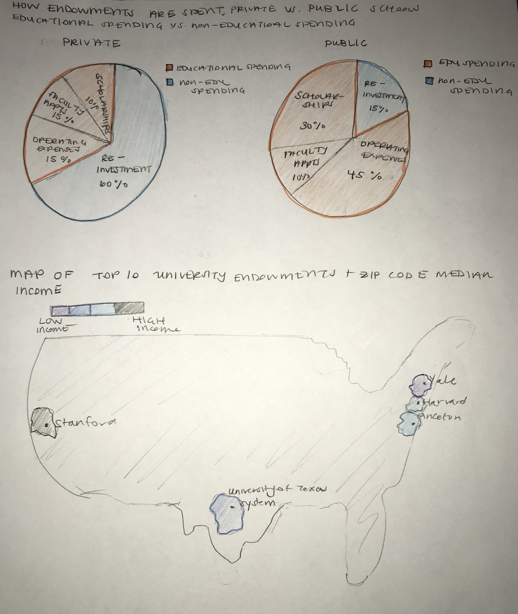
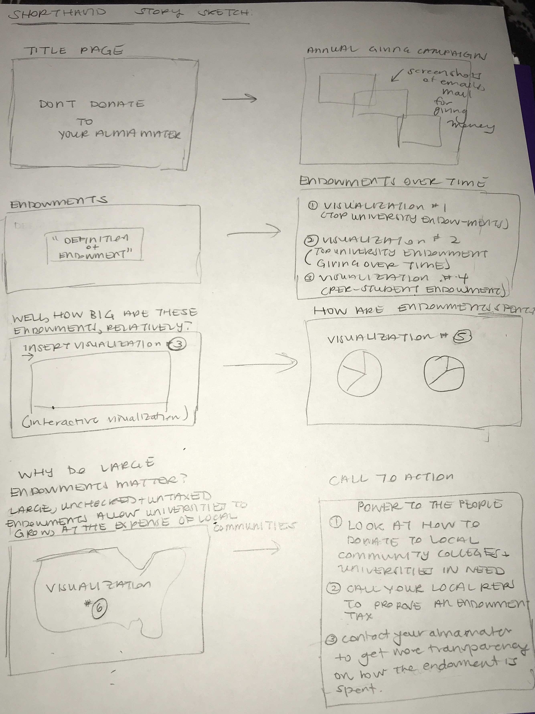

## Overview of Project - "Don't Give Money to Your Alma Mater: An Exploration of University Endowments"

The purpose of this project is to highlight the rapid growth of the endowments of the top 20 universities in the United States over the past decade and to emphasize how little of that money is actually used to benefit students. Additionally, I want to make sure to highlight how these well-endowed universities grew, in some cases, at the expense of the communities in which they reside and that the money given for university endowments is typically untaxed. Ultimately, my call to action will be something like "Don't give money to your alma mater (if you attended a top 20 university in the US). Give to a worthier cause instead." In summary, throughout my project I will explore what endowments are, how they are used, how they've grown, differences between public and private school endowment sizes, and some action items readers can take. Inspiration for this visual exploration of college endowments was gained from reading a WBUR article on inequities in college donations.[^1] 

Here's an overview of the major elements of my story:

1. Introduce the concept of an **endowment**, with a hook something like the following:
 > "If you're like me, you might receive  emails, physical mail, and annual calls from your undergraduate institution asking you to donate money. The pleas are made in earnest and emphasize how much your donation of $20 or more can help bring about meaningful change on your campus and assist future students. Something that has always confused me is why my university, whose endowment is more than $20 billion dollars, needs money from me. I often wonder -- should I be giving money to an institution that already has so much?"  

2. Provide A Definition of an Endowment &  Highlight General Trends in Endowments Over the Last Decade
 - In this section, I want to provide information about these key factors (see below in the initial sketches section for initial renderings of how these trends could be displayed): 
     - **Top 10 University Endowments (2018), Private Vs Public**. I would use this visualization as basic background to understand the differences between private and public universities, in terms of endowment spenidng. 
    - **Percent Change in Growth of Endowments Since 2000, Private Vs Public**

    - **Endowment per Student, Private vs Public**
        - With this information, I want to highlight that universities that serve many students (public universities) don't have the ability to serve their students the way that private insitutitions are able to because of a lack of state funding and endowment-based funding.
        - Additionally, prior research has shown that public institutitons are much better at moving low-income students to upper income brackets than the top 10 private insitutions are able. If we are supposed to view higher education as a way to create equal financial footing regardless of your upbringing, we should focus our attention away from private universities who thrive on exclusivity and instead divert our funds to local colleges and universities that do a much better job of elevating students in need.[^2]
    
3. Contextualize The Sheer Size of The Endowments of the Top 10 Private Universities
     -  **Top 10 Universities' Endowments As a Multiple of [insert country here]'s GDP**
         - This would be an interactive module that allows a reader to select a given university and see how many times more that university's endowment is compared to a given country's GDP. An example result would be:
         > "Harvard's endowment is three times the size of Rwanda's GDP, a country with a population of approximately 18 million."
     - **How Endowments are Spent, Public vs Private Schools**
        - This visualization would show what percent of a university's endowment is spent on educational activities and what percent is either not spent or just re-invested into the endowment fund. 
4. Why Do Large Endowments Matter?
   - In this section, I want to highlight how endowments and wealthy institutions in general can end up being a problem for the cities that they reside in. I would want to  create a map that shows the endowment size of universities relative to the median income of the neighborhoods or zip codes in which they reside.

5. Call To Action
- In this section, I will give my readers some concrete steps they can take after reading through my exploration of university endowments, such as donating to local universities, getting in touch with your local representative to lobby for taxes to be put on university endowments, and reading additional resources that have been written on this subject.

## Initial Sketches 

<u> Pivotal Visualizations for Story Progression </u>

1. Top 10 University Endowments (2018), Private Vs Public
2. Percent Change in Growth of Endowments Over Time Since 2000, Private Vs Public
3. Top 10 Universities Endowments As a Multiple of Rwanda's GDP (For this, I just chose an example comparison country so this may differ in the final version. I also envision that users can change the university that they are viewing interactively & all of the information displayed would be in the context of the initial country)
4. Endowments Per Student, Private Vs Public
5. Pie Charts of How Endowments Are Spent, Private Vs Public
6. Map of Top 10 University Locations and the Median Income

The initial sketches for the four above chart descriptions are below:

The sketches for the remaining visualizations are captured below:

<u> Storyboard Combining Main Story Elements & Visualization Placeholders </u>

<u> Sketch of Story Arc </u>

## Data Sources

The data sources I intend to use are the following:

1. **Endowment Data:** This data comes from the National Center for Education Statistics (NCES) and is available for the period from 2011 to 2018. The data is available for about 98 universities and gives the size of each school's endowment at the beginning and end of each of the fiscal years (FY) for which there is data. An example of this data is provided on this GitHub repo under endowment_example.xls. This data can also be accessed at the following link: https://nces.ed.gov/ipeds/Search?query=endowment&query2=endowment&resultType=all&page=1&sortBy=relevance&overlayDigestTableId=200947
    - I plan to use the above data to show changes in endowment size over time by university. This will help me to set the stage for my readers and provide useful context about how the size of university endowments has changed over the last decade.
2. **University Enrollment Data:** This data would be used to calculate per-student endowment numbers. This data can be found on this Github repo under enrollment_data.xls. This data can also be accessed at the following link: https://nces.ed.gov/ipeds/search?query=Enrollment%20of%20the%20120%20largest%20degree-granting%20college%20and%20university%20campuses,%20by%20selected%20characteristics%20and%20institution&query2=Enrollment%20of%20the%20120%20largest%20degree-granting%20college%20and%20university%20campuses,%20by%20selected%20characteristics%20and%20institution&resultType=all&page=1&sortBy=relevance&overlayDigestTableId=201277 
3. **Global GDP Data:**  This GDP data would be used to make comparisons between the size of some university's endowments and the GDPs of several countries. This data comes from the World Bank and can be accessed at this link: https://data.worldbank.org/indicator/NY.GDP.MKTP.CD?end=2020&start=1960&view=chart. This data has also been uploaded to this GitHub repo in the "historical_gdp_gobal.csv" file. As described above, this data would be used to contextualize the scale of the information on university endowments. Because a "billion" dollars is often hard to understand to the layperson, providing this extra data would emphasize just how large this amount of money is.
4. **Census American Community Survey (ACS) Data:** This dataset would be used in order to create the map of endowments versus median income level of the areas in which the universities of interest reside. This data comes from the Census Bureau and can be accessed on this GitHub repo under income_data.csv or can be found on the Census Bureau's data website at: https://data.census.gov/cedsci/table?q=income&tid=ACSST1Y2019.S1902&hidePreview=true. 
5. Another potential dataset that examines gentrification is found on this website: (https://www.rentcafe.com/blog/rental-market/real-estate-news/top-20-gentrified-zip-codes/). For this project, I would scrape the data from this website to get more information about zip-code level changes in median income that could be a potential indicator of gentrification. 
6. **Individual Universities Endowment Management Websites**: I will use the individual universities' websites for information on how their endowment funds are spent. I was unable to find a comprehensive dataset with this information but could find information on a per-university basis. As an example, here's a link to Princeton University's outline of how they spend their endowment funds: https://www.princeton.edu/news/2021/10/25/understanding-princetons-endowment-history-impact?utm_source=princetonedu&utm_medium=website&utm_campaign=communications. I may also, if I run into a time issue, scale back this section of the analysis to focus on two individual school comparisons instead of an overall private vs public school averages for how endowments are spent.

## Method and Medium

<u> Medium </u>

I plan on using Shorthand as my implementation medium for this project. I will use Shorthand to pull together text and visualizations into a coherent story. The section headers within Shorthand will correspond to each of the major elements of my Storyboard, as roughly sketched in the "Initial Sketches" section above.

<u> Method </u>

I plan to use the remaining part of this week to begin actually building out some of the visualizations that I have sketched above, using Flourish. To accomplish this goal, there are some additional data cleaning steps that I need to complete, such as getting all of the years of endowment data into one .csv file. I also want to start incorporating and embedding some of these initial visualizations into Shorthand to start to see how the story that I am trying to communicate is coming togehter. Then, I will spend next week starting some user research and making tweaks to my final website, as needed. Finally, I will use some of the key points in my story arc sketch to begin developing my 1-minute presentation that will occur in 2 weeks.

## References
[^1]: WBUR article about College Donation Inequity & Endowments https://www.wbur.org/cognoscenti/2019/05/07/college-donation-inequality-sylvia-brown-ayele-shakur
[^2]: https://www.brookings.edu/blog/up-front/2020/07/22/public-colleges-are-the-workhorses-of-middle-class-mobility/ 
