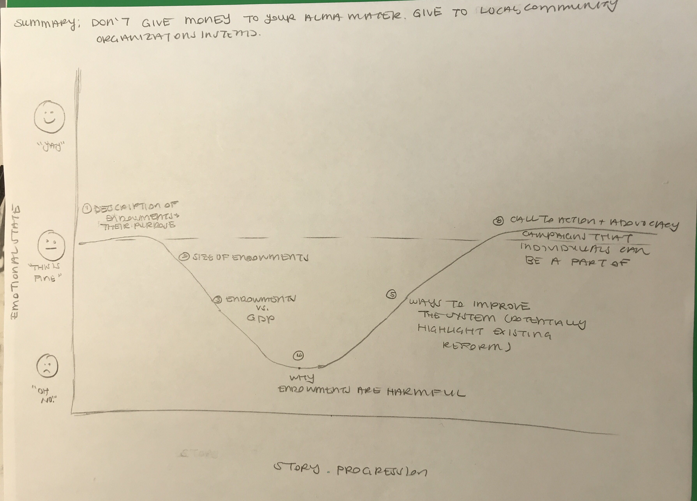

## Overview of Project - "Don't Give Money to Your Alma Mater: An Exploration of University Endowments"

The purpose of this project is to highlight the rapid growth of the endowments of the top 20 universities in the United States over the past decade and to emphasize how little of that money is actually used to benefit individual students and campus. Inspiration for this visual exploration of these inequities was gained from reading a WBUR article on inequities in college donations.[^1] Additionally, I want to make sure to highlight how these well-endowed universities grew, in some cases, at the expense of the communities in which they reside and that the money given for university endowments is typically untaxable and allowed to grow exponentially larger year or over year, even during the pandemic. Ultimtely, my call to action will be something like "Don't give money to your alma mater (if you attended a top 20 university in the US). Give to a worthier cause instead." In summary, Throughout my project, I want to explore what endowments are, how they are used, how they are marketed, and some action items readers can take after this. 

Here's a view of the major elements of my story:

1. Introduce the concept of an **endowment**, with a hook something like the following:
 > "If you're like me, you might receive  emails, physical mail, and annual calls from your undergraduate institution asking you to donate money. The pleas are made in earnest and emphasize how much your donation of $20 or more can help bring about meaningful change on your campus and assist future students. Something that has always confused me is why my university, who's annual endowment is more than $20 billion dollars, needs money from me. I also question, should I be giving money to an institution that already has so much?"  

2. Provide A Definition of an Endowment &  Highlight General Trends in Endowments Over the Last Decade
 - In this section, I want to provide information about these key trends (see below in the intial sketches section for inital renderings of how these trends could be displayed)
    - Top 5 or 10 Public Vs Top 5 or 10  Prviate School Endowments Comparison (as of 2018 (this is the latest date of the data publically avaiable from the National Center for Education Statistics)
       -  Could  get the top 5/top10 public and private school informtion from US News and World Report (https://www.usnews.com/best-colleges/rankings/national-universities) 
    - The Growth of Endowments Over Time At the Top 5 Private Universities and the Top 5 Public Universities 
    - Endowment per Student 
        - With this information, I want to highlight that universities that serve many students (public universities) don't have the ability to serve their students the way that private insitutitions are able to because of a lack of state funding and endowment-based funding. I would want to present this information in conjunction with racial & social demographic information and differences between private and public institutions. 
        - Additionally, other research has shown that public institutitons are much better at moving low-income students to upper income brackets than the top 10 private insitutions are able. If we are supposed to view higher education as a well to create equal financial footing, we should focus our attention away from private universities who thrive on exclusivity and instead divert our funds to local colleges and universities that do a much better job of elevating students in need.[^2]
    
3. Contextualizing The Sheer Size of The Endowments of the Top 5/10 Private Universities
- Visualiations would be provided on the following arenas:
     -  Top 10 Universities Endowments As a Multiple of [insert country here's] GDP
         > This could be an interactive module that allows you select a given university and both maps this data using a flag as a packground image for the visualization. An example result would be: "Harvard's endowment is twice the size of Zambia's GDP, a country with a population of approximately 18 million"
     - How Endowments are Spent, Public vs Private Schools
4. Why Do Large Endowments Matter?
   - In this section, I want to highlight how endowments and wealth institutions in general can end being a problem for the cities that they reside in. I would want to do create a map that shows the endowment size of universities relative to the median income of the neighborhoods or zip codes in which they reside.

5. Call To Action
- In this section, I will give my readers some concrete steps they can take after reading through my exploration of university endowments, such as donating to local universities, getting in touch with your local representative to lobby for taxes to be put on university endowments, and reading additional resources that have been written on this subject.

## Initial Sketches 

<u> Pivotal Visualizations for Story Progression </u>

1. Top 10 University Endowments (2018), Private Vs Public
2. Growth of Endowments Over Time, Private Vs Public
3. Top 10 Universities Endowments As a Multiple of [insert country here's] GDP (Interactive Component)
4. Relative Endowments Per Student, Private Vs Public
5. Pie Charts of How Endowments Are Spent, Private Vs Public
6. Map of Top 10 University Locations and the Median Income

<u> Sketch of Story Arc </u>

## Data Sources

 To be successful in the final project, you'll need to get a copy of the data you'll need for your final project, or recreate it based on various sources.  Make sure in all cases to record your sources and cite these data sources appropriately. 

At a minimum, you should include the following: 

- A couple of paragraphs that document your data source(s), and an explanation of how you plan on using your data. 
- A link to the publicly-accessible datasets you plan on using, or a link to a copy of the data you've uploaded to your Github repository, Box account or other publicly-accessible location. Using a datasource that is already publicly accessible is highly encouraged.  If you anticipate using a data source other than something that would be publicly available please talk to me first. 

----------------------------

The data sources I intend to use are the following:
1. **Endowment Data:** This data comes from the National Center for Education Statistics (NCES) and is available for the period from 2011 to 2018. The datasets can be accessed at the following link: https://nces.ed.gov/ipeds/Search?query=endowment&query2=endowment&resultType=all&page=1&sortBy=relevance&overlayDigestTableId=200947
2. **University Enrollment Data:** This data would be used to calculate per-student endowment numbers: https://nces.ed.gov/ipeds/search?query=Enrollment%20of%20the%20120%20largest%20degree-granting%20college%20and%20university%20campuses,%20by%20selected%20characteristics%20and%20institution&query2=Enrollment%20of%20the%20120%20largest%20degree-granting%20college%20and%20university%20campuses,%20by%20selected%20characteristics%20and%20institution&resultType=all&page=1&sortBy=relevance&overlayDigestTableId=201277 
3. **Global GDP Data:** country GDP data for comparisons, collected from the World Bank https://data.worldbank.org/indicator/NY.GDP.MKTP.CD?end=2020&start=1960&view=chart and uploaded as "historical_gdp_gobal.csv" file on this github repo.
4. **Potential Dataset on Gentrification:** This website has some scrapable data potentially but will also likely need to get into the backend of this data by going directly to the Census ACS data.  (https://www.rentcafe.com/blog/rental-market/real-estate-news/top-20-gentrified-zip-codes/) -- will need to pull Census ACS data for this (and historical median household income, etc.)

## Method and Medium

In a few paragraphs, you should document how you plan on completing your final project.  One option we've already discussed is building a story using your data using Shorthand - but this is my no means your only option.  

I plan on using Shorthand as my implementation strategy for this project. I will use Shorthand to pull together text and visualizations (that I will likely create using Flourish) in a coherent story, with sections within Shorthand corresponding to each of the major elements of my story arc, as desribed above in "Overview of Project."

## References
[^1]: WBUR article about College Donation Inequity & Endowments https://www.wbur.org/cognoscenti/2019/05/07/college-donation-inequality-sylvia-brown-ayele-shakur
[^2]: https://www.brookings.edu/blog/up-front/2020/07/22/public-colleges-are-the-workhorses-of-middle-class-mobility/ 
