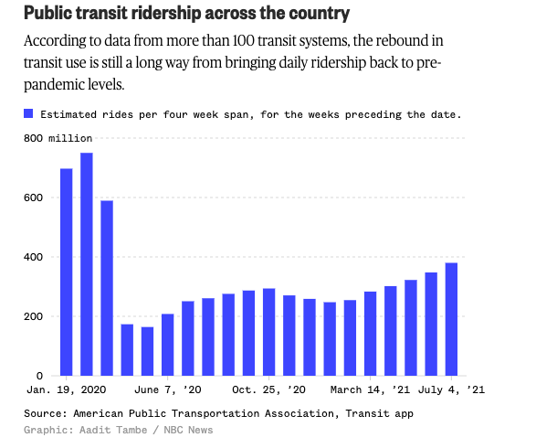
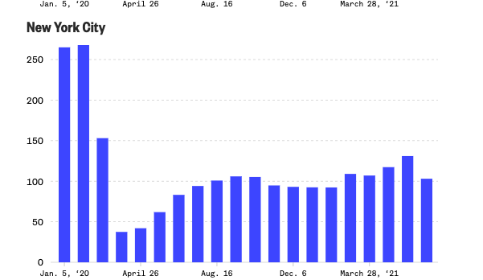
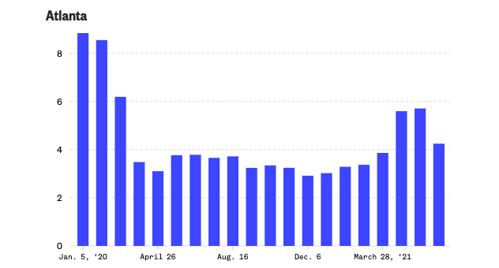
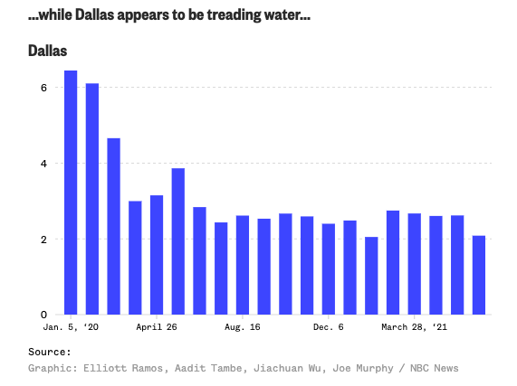
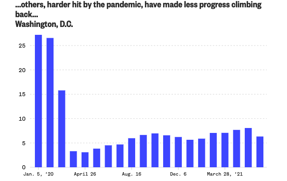
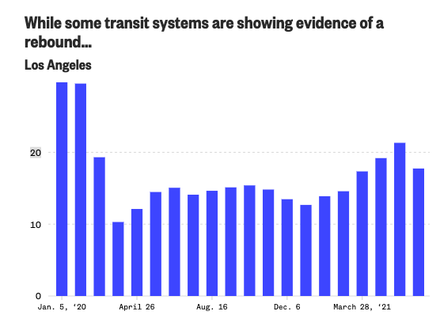
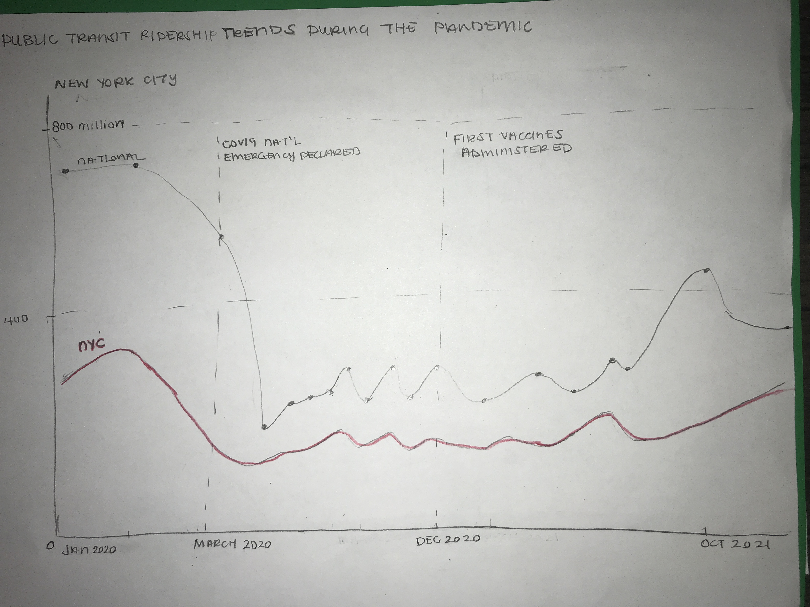

## Step 1: Find A Visualization + Its Associated Data

### Overview: Public Transit Ridership During the Pandemic
I was inspired to recreate the following visualizations because I am avid supporters of public transit initaitves and I was curious to see how the pandemic affected public transit ridership across the United States. NBC News conducted analysis to see if public transit ridership numbers have been able to return to their pre-pandemic numbers.[^1] They created a series of visualizations comparing the trends in public transit ridership in various major cities through the United States, like New York City, Atlanta, Dallas, Washington DC, and Los Angeles. 

### Original Visualizations
The names of the visualizations that I am critiquing from the NBC News article are: "Public transit ridership across the country", "While some transit systems are showing evidence of a rebound…", "...others, harder hit by the pandemic, have made less progress climbing back..."  and "...while Dallas appears to be treading water...". 

Here are the series of visualizations created by NBC on public transit ridership changes during the pandemic: 

### Data Source Description

To access the data required to create these visualizations, I visited the following website on Ridership Trends, with data retrieved through a collaboration between the American Public Transportation Association and the **Transit** App: https://transitapp.com/APTA. On this web page, I clicked bi the "download csv" button under the "Estimated change in ridership" heading to get the data set "upt_prediction.csv".[^2] This dataset is uploaded to my github page, if you are interested in examining the data for yourself.  

## Step 2: Critique the Visualization

<u>**Usefulness**</u>:

I would give this visualization an overall usefulness score of 8. I think it simply communicates valuable information about public transit ridership. Specifically, it communicates that the pandemic has caused a decline in public transit ridership and that public transit ridership numbers have yet to return to their pre-pandemic numbers. 

**Completeness**: 

I would give the visulizaiton an overall completeness score of 7. I think there needs to be more information given to the reader about what dates are considered before and after the pandemic. Presently, the dates on the x-axis seem to have been chosen haphazardly, as it is not clear what the significant of some of these dates are. Furthermore, the separation between the dates provided is the same across the overall trends graph and city-specific charts, so making comparisons becomes a little bit more difficult. Also, a small thing that I noticed is that the y-axis is not fully labeled in the city-specific graphs. The y-axis just has the numbers "25" , "20", "15", etc, without alabel for what these refer to. From the overall graph, it is clear that they-axis refers to millions, so that is also likely the scale ofthe yy-axis ont he other graphs but it would have been nice to see that labeled consistently throughout all of the graphs.

**Perceptibility**: 

I would give the visualization an 8 on this metric. I think, as mentioned before, having more visual clues and markers for why some of the chosen dates were important would make it more clear that the graphs aren't just showing transit ridership patterns **but** are also trying to communicate how these ridership patterns are related to the COVID-19 pandemic. I also think that some clarification could be made that each bar corresponds to **one** month, because at first glance, it seems like each bar might refer to one week or day before someone reads the legend and sees that each bar corresponds to a four week period (although not necessarily the beginning of one month to the end of that same month).

**Truthfulness**: 

I would give the visualization a 9 on this metric, as it does appear that the visualization is accurated and reliable. The original subtitle on the overall graph mentions that the figures given are "estimates" so there is potentially some room for error but it is good to know that this was specificed so that the numbers presented aren't taken as being the objective truth for these trends. 

**Intuitiveness**: 

I think about this in the metric incontext of "how quickly can I craft a 1 sentence summary about the graph". I can come up with this summary very quickly for this graph, so I give it an 8 on intuitiveness. The reason for the reduction in the score is because, typically, readers might expect for the data to be aggregated at the end of the month, so that you had all of the data for each month aggregated. The way that the data is currently displayed, at seemingly random points in each of the months, goes against popular intuition. However, despite these issues in the data aggregation method, the overall trend is clear to seee in the data.

**Aesthetics**: 

I would give the visualiztion a 6 on aesthetics. It makes use of color very sparingly so the color (blue) isn't distracting but I think perhaps a more muted color could be used. I think that the legend and axis text sizes are little hard to read so I may have chosena different font size and color to use. I appreciate that the grid lines were faint, so as not be distracting but, I think because of the deep blue color used, the effectiveness of the grid lines is diminished because they are hard to see at all. Therefore, I think the grid lines could be a little darker. Also, on the x-axis, It is really hard to see which bar each of the dates is in reference to, because the tick mark is so faint. My initial reaction when looking at the chart was to think that all of the bars that spanned the length of the date corresponded to the given date or the date range up to the labeled point.

**Enagement**:

I think that the visualization doesn't necessarily lead the audience to learn more about the topic displayed because of how simple the information is -- i.e. "Transit ridership declined because of the pandemic". However, it may encourage the read to share this information with others who may be interested in these trends. Thefore, I'd give the visualizaiton a 7 for engagement. 

### Question 1: Describe your overall observations about the data visualization here. What stood out to you? What did you find worked really well? What didn't? What, if anything, would you do differently?

#### Initial reaction, What worked Well, What didn't Work well, and What to Improve
My initial reaction to the above visualization was that I was pleased by how the overall simplicity and minimalism of the deisgn. It was immediately clear that some trend over time was being measured. Because the information displayed was primarily about change over time, however, it seemed like a simple line graph could have made some of the trends in the data clearer with less color. I think the choice of a deep blue is slightly distracting to the eye, and because a bar graph is used, it can feel like I am initially greeted with a wall of blue and it's a little unclear what I'm looking at intially.

In summary, the displayed trends are clear (transit ridership declined in most cities around the time of the pandemic but the post-pandemic/late pandemic recovery trends are different for different cities) but this could be displayed in an even simpler fashion.

I appreciated that the visualizations had an overall trend included as a reference point for the other trends displayed on the graph but the separation of the cities out into separate charts makes inter-city comparisons a little more difficult to do quickly.

I think that the title and subtitle collapsed into one more succicnt title because the trend that article is really trying to show is not *just* how the pandemic caused changes in transit ridership behaviors in the US *but also* to what extent recovery as occurred, in relation to pre-pandemic ridership trends. A new title could be something like "Pre and Post Pandemic Public Transit Ridership in the 3 Largest Transit Systems in the United States". 

There currently is no reference in the graph to when the pandemic occurred. Therefore, the reader has to guess where in the graph we should have expected a drop off or an explanation for why the dropoff happened at a given point in the data.  To this point, I think some indication of "phases" could be useful to help the reader isolated trends quickly. By "phases" here I mean that the dates could be simplified into a "pre-pandemic" "during pandemic" and "post pandemic/recovery phase" instead of how the time is currently delineated in the graph. This phasing would also fix the problem with the x-axis. Presently, ir is also unclear why the dates on the x-axis are formatted the way that they are. Specifically, it is really necessary to the user to know the month, day, and year for each of bars? Additionally, it's not clear why these dates were chosen, as they don't  appear to carry any cultural significance, except for July 4th. The choice of dates is not intuitve.

### Question 2: Who is the primary audience for this tool? Do you think this visualization is effective for reaching that audience? Why or why not? *

The primary audience for this tool is likely the average NBC news consumer, say someone in their mid 30s to 40s who is trying to get a quick summary about the latest news topic. They may be interested in getting a high-level, quick idea about the latest topics in public transit usage but are likely not subject matter experts in this arena.

Yes, I do think that for users seeking a simple visualization, the current charts achieve this goal. The graphs are able to quickly  communicate that, over the pandemic, transit ridership has fallen and has not yet returned to the numbers that there were at at the start of the pandemic.

The one way in which the visualization falls short is in the ability to quickly observe comparisons in the data set. Currently, users must look at 5 different graphs to try to see if there are similar trends across difference cities. This separation of the charts was likely done because the scale of the transit ridership differs drastically between the cities chosen for analysis. One way to fix this, is to limit the data to just display information about the top 3 public transit systems in the US or just present averge transit ridership numbers by region.

### Question 3: how successful what this method at evaluating the data visualization you selected? Are there measures you feel are missing or not being captured here? What would you change? Provide 1-2 recommendations (color, type of visualization, layout, etc.)

I think that this method of visual critique very effective at evaluating the data visualization, as it focused less on immediate reactions and impressions like the Good Charts methods, and more on the fidelity of the information presented and how useful the visualization is in communicating its message to a large audience. I think situating the visualizaiton's critique in the context of the intended audience is critical in understanding how to proceed in improvements. As we examined in class with the "every kid outdoors" intiaitve, if our audience is expected to be children, there is a certain amount of simplicity and removal of detail that may be more important than if the  primary audience for the visualization were adults. I appreciate that this critique method can take usefulnesss and intutitiveness for the given audience into consideration.

I think that something that could be changed about this critiuqe method is adding a  measure for "appropriateness". By "appropriateness", I mean: does the visualizaiton meet the expectations for the particular audience that is is made for? Is simple enough for kids to understand (if they are my primary audience) or is it sophisticated enough for rocket scientists to understand (if they are my primary audience)?

I think I might also add a more granular measure for "layout intuitiveness", meaning that is the information oriented in a way that the intended audience would expect -- i.e. does it take into account cultural norms. For instance, if your graphic was used in the United States, orienting trends from left to right may make sense, however, if you are operating in an Arabic-speaking country where information is written from right to left, the layout intutiveness may need to change based on the given cultural context.
 

## Step 3: Wireframe a Solution

Key factors from the critique that informed the re-design process:

1. Ability to do inter-city comparisons in one graph
2. Descreasing the amount of color used (trying to eliminating the "wall of color" that results from using a bar chart for time-series trends
3. Making the distinction between pre and post pandemic much clearer
4. Making intentional use of the x-axis of the graph (i.e. strategic selection of dates and points of time of interest)

## Step 4: Test the Solution

## Step 5: Build Your Solution (Voila!)

### References

[^1]: https://www.nbcnews.com/news/us-news/pandemic-sunk-mass-transit-use-data-shows-its-slow-recovery-n1274784
[^2]: UPT means "Unlinked Passenger Trips", which is defined here: https://www.transit.dot.gov/ntd/national-transit-database-ntd-glossary

