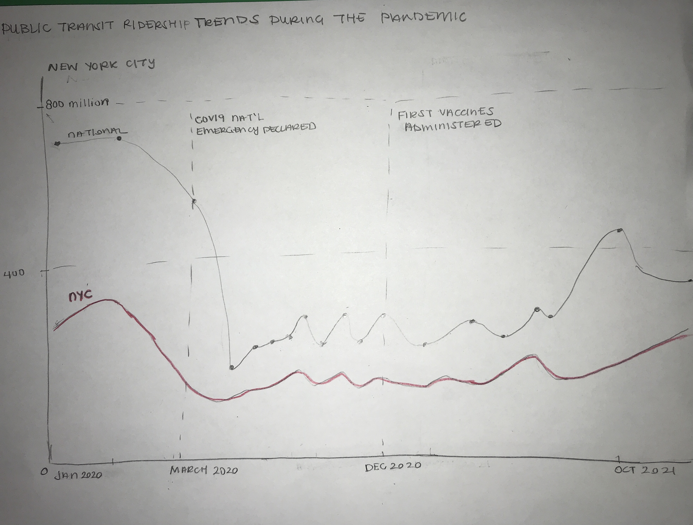
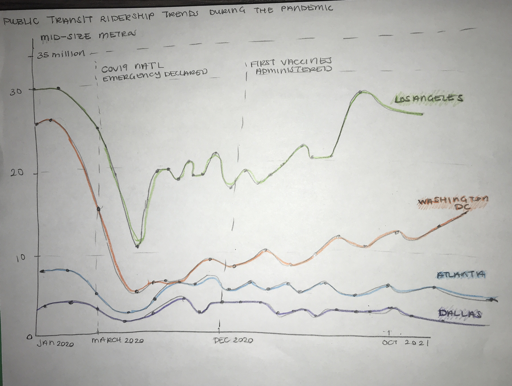

## Step 1: Find A Visualization + Its Associated Data

### Overview: Public Transit Ridership During the Pandemic
I was inspired to recreate the following visualizations because I've relied on public transit as my primary mode of transportation for the past 3 years and I was curious to see how the pandemic affected public transit ridership across the United States. NBC News conducted analysis to see if public transit ridership numbers have been able to return to their pre-pandemic levels.[^1] They created a series of visualizations comparing the trends in public transit ridership in various major cities through the United States, specifically New York City, Atlanta, Dallas, Washington DC, and Los Angeles. 

### Original Visualizations
The names of the visualizations that I am critiquing from the NBC News article mentioned above are: "Public transit ridership across the country", "While some transit systems are showing evidence of a rebound…", "...others, harder hit by the pandemic, have made less progress climbing back..."  and "...while Dallas appears to be treading water...". 

Here are the series of visualizations created by NBC on public transit ridership trends during the pandemic: 

### Data Source Description

To access the data used to create the above visualizations, I visited the following website on Ridership Trends:  https://transitapp.com/APTA. This data was collected through a collaboration between the American Public Transportation Association and the Transit App. On this web page, I clicked on the "download csv" button under the "Estimated change in ridership" heading to get the dataset labeled "upt_prediction.csv"[^2]. This dataset is uploaded to my github page, if you are interested in examining the data for yourself. I made some edits to this csv file to aggregate data at the month level for the cities used in the original visualization and these changes are available in the "transit_per_change.csv" file. 

## Step 2: Critique the Visualization

**Usefulness**:

I think it is effective at simply communicating valuable information about public transit ridership. Specifically, it communicates that the pandemic has caused a decline in public transit ridership and that public transit ridership numbers have yet to return to their pre-pandemic numbers. 

**Completeness**: 

Overall, the visualizations are fairly complete. However, the dates on the x-axis seem to have been chosen haphazardly, as it is not readily apparent why these dates were chosen. Furthermore, the separation between the dates provided is not the same between the overall trend graph and the city-specific charts. This makes it diffcult to compare the city-specific trends to the overall national trend.

Also, a small thing that I noticed is that the y-axis is not fully labeled in the city-specific graphs. The y-axis just has the numbers "25" , "20", "15", etc, without a label for what these refer to. From the overall graph, it is clear that the y-axis is measured in millions so it is likely that the y-axis scale for the other graphs is the same but it would have been nice to see the y-axis labeled consistently throughout all of the graphs.

**Perceptibility**: 

I think, as mentioned before, having more visual clues and markers for why the dates on the x-axis were chosen would make it more clear that the graphs aren't just showing transit ridership patterns **but** are also trying to communicate how these ridership patterns are related to the COVID-19 pandemic. I also think that some clarification could be made that each bar corresponds to a four week period because, at first glance, it seems like each bar might refer to one week or one day. Additionally, once you figure out that the bars represent a four-week period, you realize that more than one month could be represented in each bar because the four weeks preceding a given date could span two months. This is not an intuitive presentation of the data.

**Truthfulness**: 

I would give the visualizations a 9 on this metric, as it does appear that the visualization is accurated and reliable. The original subtitle on the overall graph mentions that the figures given are "estimates" so there is potentially some room for error but it is good to know that this was specificed so that the numbers presented aren't taken as being the objective truth for these trends. 

**Intuitiveness**: 

I think about this metric as meaning "how quickly can I craft a 1 sentence summary about the graph". I can come up with the summary very quickly for this graph, so I give it an 8 on intuitiveness. The reason why I did not give a 10 for this dimension of the critique is because, typically, readers might expect for the data to be aggregated at the end of the month. The way that the data is currently displayed, at seemingly random points in each of the months, goes against popular intuition. However, despite these issues in the data aggregation method, the overall trend is clear. 

**Aesthetics**: 

I would give the visualiztion a 6 on aesthetics. It makes use of color very sparingly but I think perhaps a more muted color could have been used. I think that the legend and axis text fonts are a little hard to read so I may have chosen a different font type and size to use. I appreciate that the grid lines were faint, so as not to be distracting, but I think because of the deep blue color used, the effectiveness of the grid lines is diminished because they are hard to see at all. Therefore, I think the grid lines could be a little darker. Also, on the x-axis, it is really hard to see which bar each of the dates is in reference to, because the tick mark is so faint. My initial reaction when looking at the chart was to think that all of the bars that spanned the length of the date corresponded to the given date or the date range up to the labeled point.

**Enagement**:

I think that the visualization doesn't necessarily lead the audience to learn more about the topic displayed because of how simple the information is -- i.e. "Transit ridership declined because of the pandemic". However, it may encourage the reader to share this information with others who may be interested in these trends. Therefore, I'd give the visualizaiton a 7 for engagement. 

### Question 1: Describe your overall observations about the data visualization here. What stood out to you? What did you find worked really well? What didn't? What, if anything, would you do differently?

My initial reaction to the visualization was that I was pleased by the overall simplicity and minimalism of the design. It was immediately clear that some trend over time was being measured. Because the information displayed was primarily about change over time, however, it seemed like a simple line graph could have made some of the trends in the data clearer and allowed the visualization to use less color. I think the choice of a deep blue for the bars in the graph is slightly distracting to the eye and a bit overwhelming. 

I appreciated that the visualizations had an overall trend chart included as a reference point for the trends displayed for specific cities. However, the separation of the cities into separate charts makes inter-city comparisons a little more difficult to do quickly.

I think that the title and subtitle could be collapsed into one, more succinct title because the trend that the article from which the visualizations come from is really trying to show is not just how the pandemic caused changes in transit ridership behaviors in the US but also to what extent recovery has occurred, in relation to pre-pandemic ridership trends. A new title could be something like: "Pre and Post Pandemic Public Transit Ridership Levels in the 3 Largest Transit Systems in the United States".

There currently is no reference in any of the visualizations to when the pandemic occurred. Therefore, the reader has to guess where in the graph we should have expected a drop off in ridership. To this point, I think some indication of "phases" could be useful to help the reader isolate trends quickly. By "phases" here I mean that the dates could be simplified into a "pre-pandemic" "during pandemic" and "post pandemic/recovery phase" instead of how the time is currently delineated in the graph. This phasing would also fix the problem with the x-axis. Presently, it is unclear why the dates on the x-axis are formatted the way that they are. Specifically, it is really necessary to the user to know the month, day, and year for some of the bars? Additionally, it's not clear why the dates on the x-axis were chosen, as they don't appear to carry any cultural significance or pandemic-specific significance. Additionally, the data is aggregated in an unintuitive way. As a reader,  you might typically expect one bar in the graph to represent one month but instead the bars could represent a four-week period that spans two months. So, some adjustments would need to be made on this front as well.

### Question 2: Who is the primary audience for this tool? Do you think this visualization is effective for reaching that audience? Why or why not? *

The primary audience for this tool is likely the average NBC news consumer, say someone in their mid 30s to 40s who is trying to get a quick summary about the latest news topic. They may be interested in getting a high-level, quick idea about the latest topics in public transit usage but are likely not subject matter experts in this arena.

Yes, I do think that for users seeking a simple visualization, the current charts achieve this goal. The graphs are able to quickly communicate that, over the pandemic, transit ridership has fallen and has not yet returned to the numbers that there were at at the start of the pandemic.

The one way in which the visualization falls short is in the inability to quickly observe comparisons in the data set. Currently, users must look at 5 different graphs to try to see if there are similar trends across different cities. This separation of the charts was likely done because the scale of the transit ridership differs drastically between the cities chosen for analysis. One way to fix this is to limit the data to just display information about the top 3 public transit systems in the US or just present average transit ridership numbers by region (i.e. Northeast, South, West, Midwest).

### Question 3: how successful what this method at evaluating the data visualization you selected? Are there measures you feel are missing or not being captured here? What would you change? Provide 1-2 recommendations (color, type of visualization, layout, etc.)

I think that this method of visual critique was very effective at evaluating the data visualization, as it focused less on immediate reactions and impressions like the Good Charts methods, and more on the fidelity of the information presented and how useful the visualization is in communicating its message to its audience. 

I think something that could be changed about this critique method is adding a measure for "appropriateness". By "appropriateness", I mean: does the visualization meet the expectations for the particular audience that is is made for? Is simple enough for kids to understand (if they are my primary audience) or is it sophisticated enough for rocket scientists to understand (if they are my primary audience)?

I think I might also add a more granular measure for "layout intuitiveness", which would examine whether the information in the visualization is oriented in a way that the intended audience would expect -- i.e. does the visualization take into account cultural norms. For instance, if your graphic was used in the United States, orienting trends from left to right may make sense, however, if you are operating in an Arabic-speaking country where information is written from right to left, the trend orientation may need to change based on the given cultural context.
 

## Step 3: Wireframe a Solution

The key factors from the critique that informed my re-design process/wireframing process were:

1. Enabling the comparison of several cities in one graph
2. Descreasing the amount of color used (trying to eliminating the "wall of color" that results from using a bar chart for time-series trends)
3. Making the distinction between pre and post pandemic much clearer
4. Making intentional use of the x-axis of the graph (i.e. strategic selection of dates and points of time of interest)

## Step 4: Test the Solution

The **first** person who I asked for feedback noted the following things about the sketches above:
- It is clear to see that the overall trend displayed is showing how transit ridership declined during the pandemic.
- The reference lines were useful to contextualize the information presented. It seemed like the ridership increase that we observe towards the end of the graph is likely because of the availability of vaccines. "I would not have otherwise known why I was seeing the upward trend at the end. I wasn't aware that the vaccines were released as early as December 2020".
- Having inter-city comparisons is useful context to help understand how common or uncommon the ridership trends are across the country.
 

The **second** and **third** people who provided feedback gave the following notes:

- The sketch shows a trend that is straightforward and therefore is generalizable enough that it can be useful for the general public or for specialist audiences who have more advanced knowledge about public transit.
- It seems like this graph would be able to be used by a news organization because of how straightforward it is. (I did not tell either of these indivduals that the original visualization that is being redesigned came from a news organization.)
- "I would like to see more points in time during the pandemic to understand how the ridership numbers changed in relation to peaks and troughs in COVID-19 infections, in addition to the reference lines already provided."
- "My eye was initially drawn to the Los Angeles line in the graph because it is the highest line on the graph, which makes it seem as though the trends shown in the graph for Los Angeles are more extreme than the trends for the remaining cities. Because of this, I think having information about relative percentages changes in ridership trends may help in being able to make more accurate comparisons between the cities in the graph."

The similarities that emerged were:

- All of those who examined my visualization were very quickly able to determine what was being dispayed. So, my design appeared to be clear to those I shared my design with.
- All of those who examiend my visualization also agreed that the reference lines added a degree of usefulness to the graph by adding a new dimension of explanation to the graph that would not have otherwise existed.
- The readers also agreed that being able to compare ridership changes between cities was important and therefore they appreciated that this information was present in my design.

The difference that emerged was:

- The first reviewer was okay with the graph just showing the raw numbers of the transit riders as the unit of comparison while the second set of reviewers advised that they would like to see percentage changes so that the changes over time don't appear to be unduly biased by the size of that particular city's public transit infrastructure to begin with.

Things to change for the final:

- One observation that was interesting to me is that by providing the time refernece lines, the main takeaway of the original visualizations seems to have been altered slightly. Particuarly, the first reviewer of the sketch noted that it seemed like the graph was showing how the vaccine availability changed public transit ridership behaviors, when the original graph was focused on interrogating the question of whether ridership numbers had returned to their pre-pandemic levels. By including the reference lines there seems to be a change in the purpose of the graph from showing an overall trend to providing a causal claim about why the trend appears. I will still keep the reference lines because they allow for mutiple takeaways from the graph -- both that transit ridership levels have not returned to their pre-pandemic levels and that the events displayed may have had an effect on these ridership numbers.

- In response to the feedback from reviewers two and three on having relative percent change information, I decided to alter my visualization to examine percentage change over time. This would allow me to include all cities in one graph instead of two. In trying to maintain the same objective as the original visualizations, namely determining if public transit ridership has **rebounded**, the percentage change values will be calculated relative to Jan 2020, which is used as the "pre-pandemic" norm. 

## Step 5: Build Your Solution (Voila!)

Taking all of the insight gained from the critique and from feedback to my wireframing, here's my final visualization. 

### Final Visualization:

### Reflection

One of the difficult things in creating this final visualization was deciding how to reduce the number of colors of the graph. I ultimately settled on doing a comparison of inland vs costal cities, rather than having a different color for each of the cities. 

### References

[^1]: https://www.nbcnews.com/news/us-news/pandemic-sunk-mass-transit-use-data-shows-its-slow-recovery-n1274784
[^2]: UPT means "Unlinked Passenger Trips", which is defined here: https://www.transit.dot.gov/ntd/national-transit-database-ntd-glossary

[Return to the Home Page](README.md)

